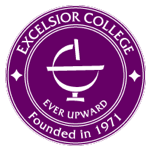

The Diagnostic Assessment and Achievement of College Skills and the Self-Regulated Learning Lab is funded by the Department of Education in the Fund for the Improvement of Postsecondary Education First in the World grant program. Excelsior College is working in partnership with Western Governors University, Rutgers University, and the University at Albany. DAACS is an open source project. Institutions are free to use and adapt DAACS for the specific needs of their students.

  

## Project Personnel

<h3>Project Director</h3>
<b>Jason Bryer</b>, Ph.D. Excelsior College
    		
<h3>Co-Project Directors</h3>
<b>Timothy Cleary</b>, Ph.D. Rutgers University 
<b>Heidi Andrade</b>, Ed.D. University at Albany
    
<h3>Evaluator</h3>
<b>Barbara Storandt</b> ALTA Solutions Group, LLC
		

<h3>Advisory Committee</h3>
<b>Jason Levin</b>, MBA Western Governors University 
<b>Phil Winne</b>, Ph.D. Simon Fraser University 
<b>Ronald Dugan</b>, Ph.D. The College of Saint Rose 
<b>Glenn Braddock</b>, Ph.D. Excelsior College 
<b>Lisa Daniels</b>, Ph.D. Excelsior College 
<b>Francesco Crocco</b>, Ph.D. Excelsior College 
<b>Abbe Herzig</b>, Ph.D. 

<h3>Other Personnel</h3>
<b>Marc Verdi</b>, Project Manager 
<b>Angela Lui</b>, M.S. 
<b>Diana Akhmedjanova</b>, M.S. 
<b>Kara Hogan</b>, Ph.D. 
<b>David Franklin</b>, M.S. 
<b>Chelsea Barnet</b>, M.Ed. 
<b>Jessica Stokes</b>  
<b>Bracha Schnaidman</b>  
<b>Nikki Schreihofer</b>  
<b>Erica Pawlo</b>  
<b>Jane Weyers</b>, Grants  
<b>Bethany de Barros</b>, Grants  
<b>Patti Croop</b>, Grants  
<b>Donn Aiken</b>, Information Technology  

<!-- Container -->

## Selected References

Chick, N. (2016). Metacognition. In *Vanderbilt University Center for Teaching*. Retrieved from https://cft.vanderbilt.edu/guides-sub-pages/metacognition/

Cleary, T. J. (2014). *Development of SRL strategies* – SREP guide

Duckworth, A. (2016). *Grit: The Power of Passion and Perseverance*. Scribner. 

Dweck, C. (2009). *Mindset: The New Psychology of Success*. Ballantine Books.

Tanner, K. D. (2012). Promoting student metacognition. *Cell Biology Education – Life Sciences Education, 11*, 113-120. doi: 10.1187/cbe.12-03-0033

Teaching Excellence in Adult Literacy (TEAL) Center (2012, February). Fact sheet: Metacognitive processes. In *Teaching Excellence in Adult Literacy*. Retrieved from https://teal.ed.gov/tealguide/metacognitive

